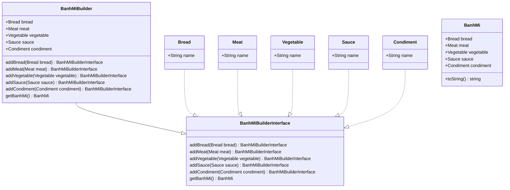

# Builder design pattern in PHP

This is a simple implementation of the builder design pattern in PHP.

## UML diagram



## Installation and run
1. Clone the repository
2. Run `composer install`
3. Run `php src/main.php`

## Usage
```php
$banhMiBuilder = new BanhMiBuilder();
$banhMiBuilder
    ->addBread(new Bread("Banh Mi"))
    ->addMeat(new Meat("Thit"))
    ->addVegetable(new Vegetable("Rau"))
    ->addSauce(new Sauce("Nuoc"))
    ->addCondiment(new Condiment("Pho Mai"));
$banhMi = $banhMiBuilder->getBanhMi();
echo $banhMi->toString();
```

## Output
```bash
--------------------------------------------
Bread: Banh Mi
Meat: Thit
Vegetable: Rau
Sauce: Nuoc
Condiment: Pho Mai
--------------------------------------------
```